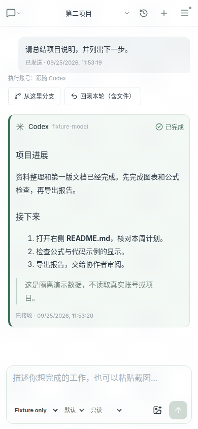

# Relay

**把自己的电脑变成工作台，在电脑和手机上继续工作。**

浏览器中使用 Codex、Claude 和 Kimi，管理对话、文件与终端。文件和工作台数据保存在你的服务器上；模型请求仍由对应提供方处理。本项目代码由AI生成。


## 能做什么

| 功能       | 说明                                                          |
| ------------- | ------------------------------------------------------------- |
| 多账号快速切换 | Codex / Claude / Kimi，模型选择、额度、流式回复与审批         |
| 远程访问   | 默认局域网, 躺在沙发上用手机与 AI 协同工作；启用 Tailscale 与云服务器中转后，可随时随地用手机远程指挥 AI 工作；将 AI 部署在稳定的网络环境中，不受出差网络环境波动的影响 |
| 文件预览   | 可预览Markdown、PDF、代码和图片文件，对话中latex数学公式可直接预览|
| 多用户协作 | 独立 Linux 身份、项目权限与协作锁                            |
| 历史与恢复 | 持久任务、断线恢复；Codex 原生历史、分支与文件回滚            |
| 终端       | 项目内可打开服务器终端，支持手机辅助按键                      |

详情见 [完整使用手册](docs/manual.md)。公网访问使用 HTTPS，局域网 HTTP 仅用于可信网络。


## 三步开始

在 **Linux 普通用户**的终端运行：

```bash
git clone https://github.com/YOUR_NAME/relay.git
cd relay
./install.sh
```

将 `YOUR_NAME` 换成仓库所有者。需要 Git、Python 3、curl、xz，以及联网下载依赖；安装器自动准备 **Node.js 24、指定版本 Codex CLI、项目依赖和局域网入口**。多网卡时会让你选择地址。

安装完成后打开终端显示的网址，用 `./relay info` 查看随机登录密码。进入右上角 **账号管理 → 添加账号并授权**，即可选择项目开始工作。

支持 systemd 用户服务时自动后台启动；没有 systemd 时运行 `./relay start`，保持终端开启。退出登录后仍需运行的用户，按安装器提示开启 linger。[安装选项与常见问题 →](docs/quickstart.md)

## 看看界面

以下为实际界面录制，使用隔离演示数据，不包含真实账号或项目。点击静态截图可查看清晰大图。

**电脑端：对话、文件预览和远程管理**


[查看电脑端静态截图](docs/images/desktop.png)

**手机端：切换对话与文件，随时继续**



[查看手机端静态截图](docs/images/mobile.png)


## 日常使用

```bash
./relay info       # 地址、账号和密码
./relay status     # 查看状态
./relay start      # 启动
./relay stop       # 停止后台服务
./relay logs       # 后台服务日志
```

更新前等任务完成，再按 [升级步骤](docs/quickstart.md#升级) 操作。配置与数据位于私有 `.runtime/`，重复安装不会覆盖。

## 文档

[快速安装](docs/quickstart.md) · [完整使用手册](docs/manual.md) · [部署与备份](docs/deployment.md) · [共享项目](docs/shared-projects.md) · [新增用户](docs/add-relay-user.md) · [故障排查](docs/troubleshooting.md)

[架构](docs/architecture.md) · [协议兼容性](docs/protocol-compatibility.md) · [实施状态](docs/implementation-status.md) · [设计规格](plan.md) · [API](docs/openapi.json) · [发布说明](docs/releases/0.2.0.md)
