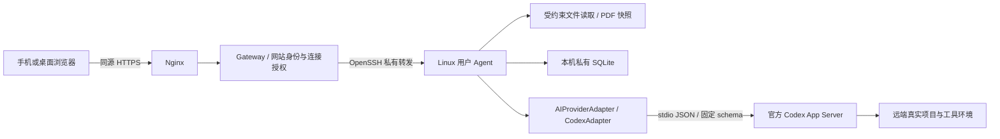

# 架构与可靠性

## 层与存储

`apps/web` 不持有 SSH 或 Codex 凭据，只使用同源业务 API。网页草稿、阅读位置、选中文本引用保存在当前浏览器的 sessionStorage；没有 Service Worker，没有离线缓存项目全文或会话。退出登录清除本地界面状态。

界面采用顶部单行工具栏、中部可滚动对话和底部输入框；模型、历史、新建共用顶栏，连接身份置于工作区菜单。历史入口统一展示 Relay 项目对话和原生会话，按原生会话 ID 去重并保留自定义标题；改名功能位于历史列表内，支持本地与原生会话；历史窗口保留列表刷新，去掉说明文案与刷新当前对话记录，列表右侧以紧凑竖排图标提供改名和打开操作；不再提供独立的对话设置按钮。工作区菜单通过“切换项目”按最近使用顺序列出项目，支持名称与路径搜索、当前项目及运行任务标记；“打开新项目”复用目录选择器，同一目录复用已有项目。切换项目恢复该项目的对话、草稿与文件状态，最近访问记录按连接保存。文件夹入口和目录选择器以当前项目为起点。普通对话与原生共享历史将每轮工具记录合并为一个默认收起的“执行记录 · N 项”入口，展开后可逐条查看命令与输出。记录更新保留当前展开状态，折叠时不挂载工具详情；正文、错误、待审批操作及提问仍直接展示。

`apps/gateway` 使用本地 SQLite 保存已哈希的网站会话、登录限速记录、连接身份绑定和启用状态；配置文件保存 owner、连接元数据和秘密文件引用。每条业务请求都重新核验授权和 Agent 身份，禁止任意 URL 或协议方法转发。没有项目正文／会话磁盘缓存，不记录请求或响应正文。

`packages/transport-ssh` 启动系统 OpenSSH、严格 known_hosts、不转发 SSH agent。转发源采用 Gateway 私有 Unix socket（替代设计示例的回环 TCP），目标为远端用户私有 Agent socket。SSH 仅建立隧道，不启动或托管远端 Agent。

`apps/agent` 通过独立常驻服务运行，以真实 Linux 用户工作。各 Workspace 使用规范目录与设备/inode 身份绑定，不能只凭路径字符串认定同一项目。私有目录700、凭据和数据库600。SQLite WAL + FULL同步；数据库提交后才推送事件。

`packages/provider-core` 定义不包含 SSH、文件服务或前端组件的 Provider 接口。`provider-codex` 是唯一处理原生 Codex 请求／响应／通知的模块。真实生产 Provider 只有 Codex，Mock 仅用于测试。

## 任务与连接

连接中断只影响观察者，不标记任务失败。Agent 持续读取 Codex stdout，将事件与任务状态在同一 SQLite 事务提交，然后广播 SSE。Gateway 或浏览器连接关闭不调用取消或停止 Provider。

发送、取消、审批均使用持久 `clientRequestId`。同 ID 相同负载返回原逻辑结果，不同负载409。不会在重连时重发用户任务。外部副作用不保证 exactly-once；上游提交结果丢失时标记 uncertain，保留锁，不盲目重试。

Agent 重启将原活动任务标 interrupted，原 starting 标 uncertain，并使旧代际审批失效。历史与原生引用保留。锁租约无法确认释放时留有持久记录；管理员必须核实原生进程及文件后处理，不能仅按 PID 或时间自动清除。

每个工作区一个惰性 Codex 进程，默认最多4个；空闲进程可被淘汰，活动和待审批进程不会因切换页面卸载。Codex 一轮完成且启动请求的有效权限检查结束后，Agent 释放并关闭该工作区的原生进程，避免占用会话 writer 锁或继续使用陈旧历史；后续任务重新恢复原生 ID。运行记录保存该轮模型、推理强度和权限。默认关闭未完整支持的插件/MCP/其他外部工具，只保留能完整展示和回答的协议路径。

## ChatGPT 多账号

网站 owner 身份与 ChatGPT 账号选择独立。根 Agent 保存账号 ID、名称和公开账号信息。「跟随 Codex」通过官方客户端使用共享目录的登录状态；命名账号各有 `stateDir/accounts/<uuid>/codex` 授权环境和 `stateDir/accounts/<uuid>/state` Relay 数据库。所有执行 Adapter 使用根 Agent 的 `CODEX_HOME`，从而共享原生 rollout、索引和 writer 锁。

每个命名账号 Manager 拥有一个 `CodexAuthBroker`，用官方 app-server 完成设备码登录、取消和 managed token 刷新。Broker 仅读取该账号自己的文件凭据缓存，检查所有者、私有权限、普通文件及账号 ID；不读取共享 Codex 数据目录中的默认账号的凭据正文。访问令牌经 stdin 注入执行进程的 `account/login/start(type=chatgptAuthTokens)`，执行进程使用 ephemeral 凭据存储。遇到 `account/chatgptAuthTokens/refresh` 请求，校验其绑定账号，合并同 Broker 的并发刷新，再由官方 managed 进程刷新，返回同一账号的新令牌。失效或身份变化失败关闭，不自动改用其他账号。原始凭据不进入浏览器、Relay 数据库或错误日志，JWT 也进行脱敏。实验接口绑定当前固定 Codex 版本。

`/providers/codex/accounts` 列出或创建账号；`/accounts/<uuid>/...` 明确指定任务、模型、SSE 和授权的账号作用域。Gateway 继续验证 owner、CSRF 与根 Agent 身份，按白名单转发私有 Unix socket。每个账号保留独立 Relay 资源 ID 和事件序列；原生会话通过原 ID 导入当前账号，不复制成新对话。网页切换时重建本账号的 Relay 映射并保留原生会话；新任务持久化提交时的账号配置及标签，旧任务不补造账号归属。

账号服务共用根目录锁；原生 writer 锁另外保护 VS Code 和各账号对同一线程的占用。服务状态包含所有账号的活动任务。授权目录、共享 Codex 目录和整个根状态目录均对文件浏览接口隐藏。首次打开旧账号时，用双端原生 writer 锁、原 ID 冲突检查和逐文件校验清单迁移旧 rollout，原件保留；不复制 auth.json 或 SQLite，不覆盖已迁移并继续写入的共享会话。备份需覆盖共享 Codex 历史、各账号授权目录，以及通过 SQLite 备份 API 保存的根／子账号 Relay 数据库。

## 原生会话共享

IDE 和 Agent 共用同机同用户的 `CODEX_HOME`，通过官方 `thread/list`、`thread/read`、`thread/turns/list`、`thread/resume` 访问同一份原生记录。网页“Codex 会话”默认发现全部可访问项目，也可筛选当前项目；未选项目时使用 `/providers/codex/sessions`。Agent 在显示标题前复核允许根、敏感路径和目录身份，并过滤其他提供方及子代理。

导入按原生元数据中的 cwd 打开原项目，保留原生 ID；无需额外的项目信任确认；旧记录中的信任标记在启动时清理。历史读取及继续执行仍绑定该目录并重新验证。Agent 只保存自身关联和执行记录，不直接改写 Codex 数据库或 rollout。

共享历史以原生每轮 ID 和时间关联，手动刷新及浏览器重新获得焦点时重读，显示最近最多100轮和有界文本。原生 writer 锁独立于工作台目录锁：它阻止两端同时恢复同一会话，普通发送遇到占用冲突时不自动接管。用户可点击“在此接管”，预览同一 Codex 进程占用的全部会话，二次确认后向该进程发送 SIGTERM，并确认退出。预览两分钟内有效，执行前重新核验同用户、原生 writer 锁、进程启动身份及受影响会话列表；使用 Linux pidfd 防止 PID 复用。不会删除锁文件、改写原生历史或自动重发任务。无法核验全部会话权限、占用者改变或退出未确认时拒绝继续；重复请求不再次发送停止信号。外部命令可能继续运行，原客户端也可能重新占用会话，因此界面明确提示用户检查执行结果后再发送。不同机器或不同 `CODEX_HOME` 之间没有历史云同步；浏览器草稿与阅读位置也不纳入共享。

## 文件与锁

Linux Python 辅助模块使用目录 fd、`openat` 风格的逐级 `O_NOFOLLOW` 打开及父子身份复验。V1 保守拒绝所有符号链接与硬链接普通文件、特殊设备/FIFO、敏感路径以及编码穿越，不只依赖 startsWith 或预先 realpath。

文件预览建立远端私有不可变快照。默认单文件上限50MB、总缓存256MB、15分钟过期；文件 version 绑定真实 workspace、路径和快照。PDF.js 只从同一 version 读取范围。过期409要求新建预览，范围无效416。SVG/HTML按源码处理，Markdown不解析原始HTML，外部图片不自动加载。

所有执行任务（包括可能申请写权限的只读任务）均持有协作目录锁。锁用机器摘要与设备/inode以及祖先身份检测同目录/重叠目录冲突。共享目录须管理员配置同一2770共享锁目录；没有配置时失败关闭，不宣称跨用户并发安全。锁只约束参与的工作台，无法锁住外部编辑器。

Agent 私有文件显式设置权限；Codex 子进程独立设置 taskUmask（默认0022，可选0002），避免服务的私有 umask 破坏共享项目协作。不会递归 chmod 项目或修改用户全局 umask。

## 限额、保留与备份

运行时请求体256KB。事件保留默认10000条，消息对象2000条，文件观察记录2000条；过旧 SSE cursor 返回 snapshot_required，浏览器重新快照同步。会话和去重收据不会自动失效，从而避免旧请求 ID 重新执行；长期运行需监控磁盘并定期备份。大规模历史归档不是当前版本能力。

使用 `scripts/backup-database.ts` 的 SQLite 备份 API；不要直接复制正在写入的 sqlite 主文件。服务日志由 systemd journal 管理，不含项目内容和凭据正文。

## 对话图片附件

浏览器支持文件选择和粘贴 PNG/JPEG/WebP，每条任务最多 4 张。原图限制 20 MiB / 4000 万像素；Canvas 去掉元数据，最长边缩至 4096，优先 PNG，必要时转 JPEG，每张处理后最多 700 KiB，兼容现有 Nginx 1 MiB 请求限制。支持图片的模型接收原生 `turn/start.input` 的 `image` 数据项（内嵌 data URL），不把文件名当作图片内容。

上传走已登录、CSRF 与连接 owner 校验的项目接口。Agent 上传路由单独允许 1 MiB 请求，其余路由保留原有上限。Agent 校验格式、尺寸和项目归属；文件保存在 `stateDir/images`（目录 0700、文件 0600），数据库仅存元数据和摘要，读取拒绝符号链接、硬链接和摘要不一致。累计图片上限 512 MiB；未发送图片超过 24 小时后在下一次上传时清理，已发送图片保留。图片下载同样需要认证，不提供公共链接。

Run、事件和快照只携带图片元数据，执行时加载图片内容。已上传草稿的元数据保留在当前浏览器会话中；发送失败后可保留附件并沿用请求 ID 重试。数据库备份工具仅备份数据库；备份附件需要同时备份 Agent 的 `stateDir/images` 目录。项目文件回滚不会删除对话图片。

默认登录同步通过独立的短生命周期 Codex 进程读取公开账号、模型和额度，三类查询共享一次探测和 10 秒缓存；设备码登录事件使缓存失效。该进程不订阅任务事件，不重启正在执行任务或等待设备码登录的进程，关闭 Agent 时一并清理。执行前回收仅用于浏览历史的可释放 Provider，每轮重新加载官方登录。网页可见时定期查询、重新聚焦时查询，失败或退出登录时清除旧账号和旧额度显示。

## 文件面板传输

`POST /workspaces/:w/uploads` 使用 start/chunk/finish/cancel 分块协议，每块原始数据最多 192 KiB（base64 JSON 小于 1 MiB），仅该路由增加 Agent 请求体上限。单文件 100 MiB，同时最多 16 个上传、512 MiB 声明容量；暂存于私有 `transfers/`，不写入项目或向模型发送内容。30 分钟无操作的暂存定时清理，Agent 重启时清理旧暂存。finish 复用 Manager 的空闲项目检查、维护状态及跨用户目录锁，通过 fd-relative Python 辅助模块创建缺失目录、写入临时文件并原子提交；已存在的目标（包括链接）一律返回 409。按 taskUmask 创建项目文件，遵守共享目录组与默认 ACL。取消保留此前完成的文件，文件夹上传不是整批事务。

`POST /workspaces/:w/downloads` 准备单文件原始副本或 ZIP，`GET /workspaces/:w/downloads/:id` 通过文件流下载。ID 绑定当前 Agent/账号与工作区，仍需所有现有授权，不提供公共链接。单次原始内容上限 256 MiB、10000 项、64 层，ZIP 使用 STORE 打包以约束 CPU，保留项目相对路径；目录内敏感项、链接及无法读取项会被跳过并计数，直接选择受保护文件则拒绝。生成时逐文件复核身份与修改时间，保持祖先 fd 校验。每个账号同时只生成一个下载，最多保留 4 个副本，达到数量或已有副本 256 MiB 上限时优先淘汰已传出的旧副本，没有可淘汰项则拒绝再创建；新副本最多额外使用约 256 MiB 加 ZIP 元数据空间。下载副本 5 分钟过期，定时与关闭服务时清理，Gateway 和账号代理只转发文件流。传输数据无需加入持久备份。
